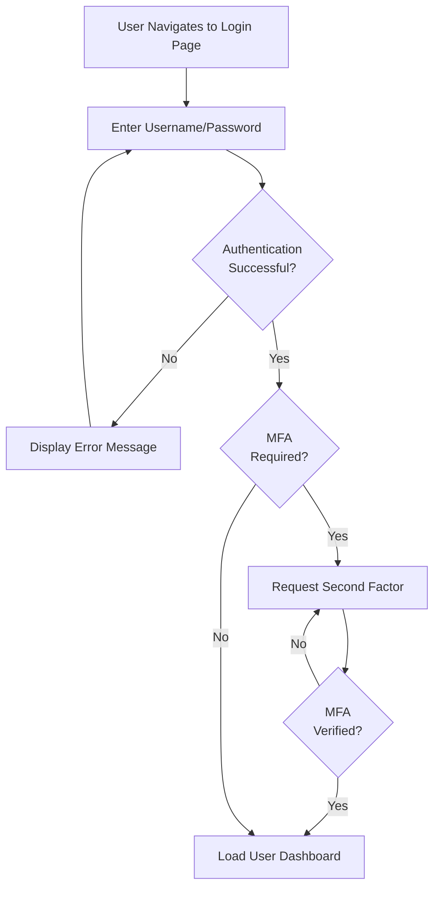
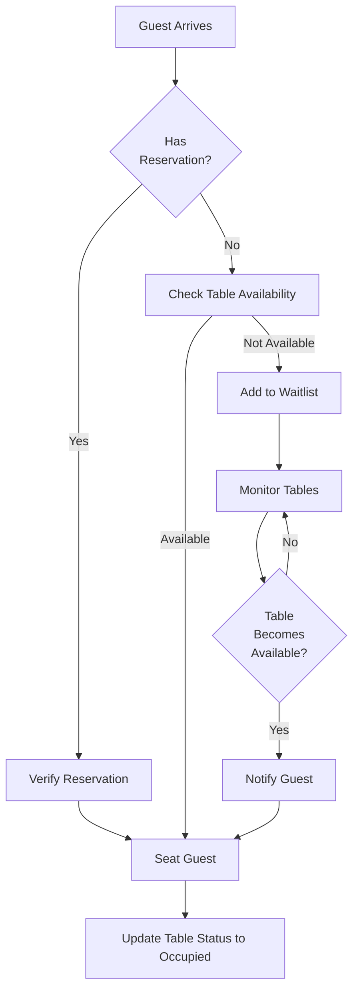
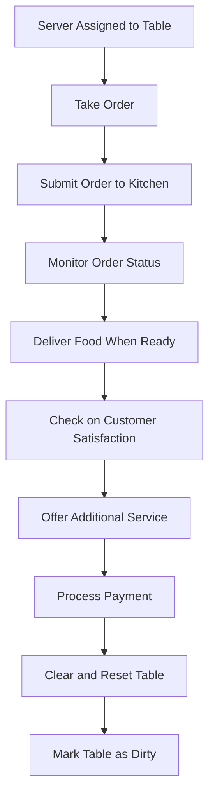
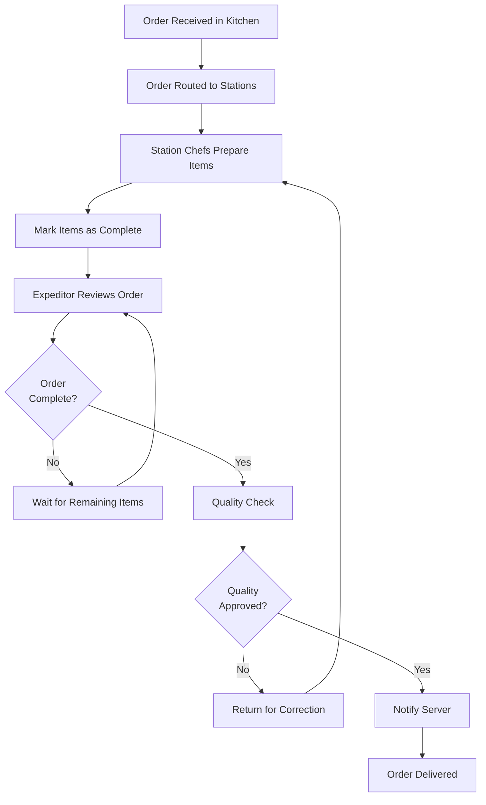
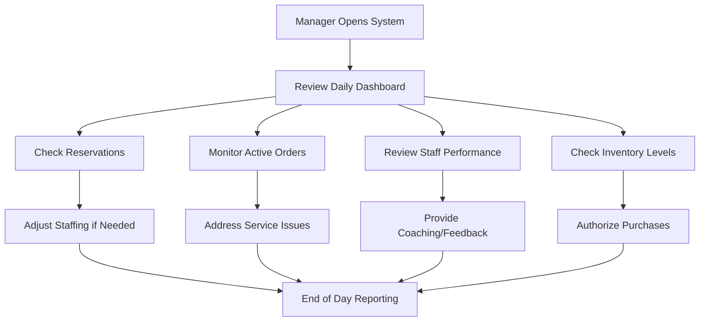
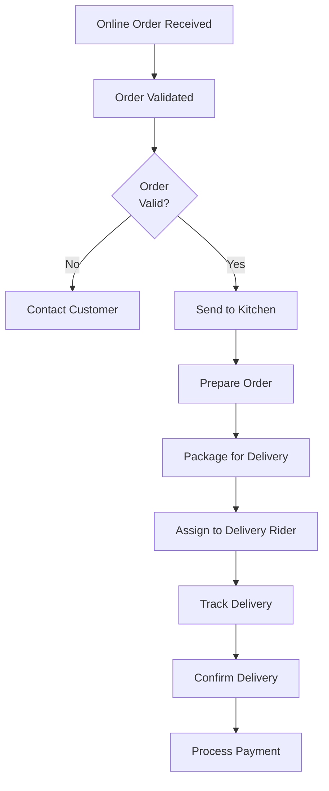

# Restaurant Management System: User Workflows

## 1. Introduction

This document provides a comprehensive overview of the user workflows within the Restaurant Management System. It details how different users interact with the system based on their roles, responsibilities, and day-to-day operational tasks.

The Restaurant Management System is designed to streamline restaurant operations across multiple functional areas, including table service, kitchen management, inventory control, and customer engagement. Each user role has specific workflows tailored to their responsibilities within the restaurant ecosystem.

## 2. User Roles Overview

The system supports multiple user roles, each with specific privileges and responsibilities:

| Role | Description | Primary Responsibilities |
|------|-------------|--------------------------|
| Guest | Restaurant customer | View menu, place orders (when implemented) |
| Host | Front-of-house staff managing seating | Manage reservations, waitlist, and table assignments |
| Server | Wait staff serving customers | Take orders, manage table service |
| Cashier | Staff handling payments | Process payments, issue receipts |
| StationChef | Kitchen staff responsible for specific stations | Prepare specific menu items, manage station inventory |
| Expeditor | Kitchen staff coordinating food delivery | Coordinate order completion, ensure quality control |
| InventoryClerk | Staff managing inventory | Track stock levels, record usage |
| PurchasingManager | Staff handling procurement | Order supplies, manage vendors |
| RestaurantManager | Management role | Oversee operations, access reports |
| DeliveryRider | Staff handling deliveries | Deliver orders to customers |
| Accountant | Financial staff | Handle financial transactions and reports |
| SystemAdmin | IT administrator | Manage system settings, users, and configuration |

## 3. Authentication Workflow

### 3.1. Login Process

1. User navigates to the login page
2. User enters credentials (username and password)
3. System authenticates the user
4. If Multi-Factor Authentication (MFA) is enabled:
   - System prompts for additional verification
   - User provides the required second factor
5. Upon successful authentication:
   - User is redirected to the appropriate dashboard
   - System loads permissions based on user role
   - Session is established with appropriate timeout

### 3.2. Password Management

1. New users receive a temporary password
2. First login requires immediate password change
3. Password expiration policies enforce regular updates
4. Password recovery:
   - User requests password reset
   - System sends reset link to registered email
   - User creates new password

## 4. Host Workflows

### 4.1. Reservation Management

1. Create New Reservation
   - Enter customer details
   - Select date and time
   - Specify party size
   - Assign table (optional)
   - Record special requests
   - Confirm reservation

2. Manage Existing Reservations
   - View upcoming reservations
   - Edit reservation details
   - Cancel reservations
   - Send confirmation notifications

### 4.2. Waitlist Management

1. Add to Waitlist
   - Record customer name
   - Note party size
   - Capture contact information
   - Estimate wait time

2. Manage Waitlist
   - Update wait times
   - Notify customers when table is ready
   - Remove from waitlist

### 4.3. Table Management

1. Table Assignment
   - View available tables
   - Assign servers to sections
   - Seat guests from reservations or waitlist
   - Update table status

2. Table Status Tracking
   - Mark tables as Available
   - Mark tables as Occupied
   - Mark tables as Dirty
   - Mark tables as Clean

## 5. Server Workflows

### 5.1. Order Taking

1. New Order Creation
   - Select table
   - Add menu items
   - Record special instructions
   - Specify cooking preferences
   - Submit order to kitchen

2. Order Modification
   - Add items to existing order
   - Remove or modify items
   - Split or combine orders

### 5.2. Order Management

1. Order Status Tracking
   - View preparation status
   - Receive notifications when order is ready
   - Deliver food to table

2. Course Management
   - Fire specific courses at appropriate times
   - Coordinate timing with kitchen

### 5.3. Table Service

1. Service Tasks
   - Record beverage refills
   - Respond to customer requests
   - Manage coursing
   - Clear plates

2. Payment Processing
   - Generate check
   - Process payment
   - Split checks when requested
   - Apply discounts or promotions
   - Close table

## 6. Kitchen Workflows

### 6.1. Station Chef

1. Ticket Management
   - View incoming orders for station
   - Prioritize tickets
   - Mark items as in progress
   - Complete preparation
   - Mark items as ready for expediting

2. Inventory Management
   - Check stock levels before service
   - Report shortages
   - Request replenishment

### 6.2. Expeditor

1. Order Coordination
   - Ensure all components of an order are complete
   - Quality check prepared items
   - Consolidate multi-station orders
   - Notify servers when orders are ready
   - Manage timing for multi-course meals

2. Kitchen Communication
   - Communicate timing needs to station chefs
   - Coordinate special requests
   - Manage order modifications

## 7. Cashier Workflows

### 7.1. Payment Processing

1. Check Generation
   - View table's order details
   - Generate itemized check
   - Apply taxes
   - Calculate totals

2. Payment Collection
   - Process credit card payments
   - Handle cash transactions
   - Apply gift cards or vouchers
   - Split checks among multiple payment methods
   - Process refunds when necessary

### 7.2. End of Day

1. Closing Procedures
   - Generate shift report
   - Reconcile cash drawer
   - Process credit card batches
   - Report discrepancies

## 8. Manager Workflows

### 8.1. Staff Management

1. Scheduling
   - Create and publish staff schedules
   - Manage time-off requests
   - Handle shift swaps or coverage needs
   - Track attendance

2. Performance Management
   - Monitor server sales
   - Track kitchen performance metrics
   - Review customer feedback

### 8.2. Reporting

1. Financial Reporting
   - View daily sales summaries
   - Analyze revenue by category
   - Monitor labor costs
   - Review payment methods breakdown

2. Operational Reporting
   - Table turnover analysis
   - Kitchen ticket times
   - Popular menu items
   - Inventory usage

### 8.3. Configuration Management

1. Menu Management
   - Add or update menu items
   - Adjust pricing
   - Configure specials
   - Manage categories

2. Restaurant Settings
   - Configure tables and floor plan
   - Set up kitchen stations
   - Manage user accounts
   - Define operational parameters

## 9. Inventory Management Workflows

### 9.1. Inventory Clerk

1. Stock Management
   - Record inventory levels
   - Track usage
   - Identify items requiring replenishment
   - Manage stock rotation
   - Conduct inventory counts

2. Reporting
   - Generate inventory reports
   - Flag discrepancies
   - Track wastage
   - Monitor costs

### 9.2. Purchasing Manager

1. Vendor Management
   - Maintain vendor information
   - Compare pricing
   - Evaluate performance

2. Ordering Process
   - Create purchase orders
   - Schedule deliveries
   - Receive and verify orders
   - Reconcile invoices
   - Manage returns

## 10. Online Order Workflows

### 10.1. Order Integration

1. External Platform Integration
   - Configure third-party delivery services
   - Map menu items to external platforms
   - Set pricing and availability

2. Order Processing
   - Receive incoming orders
   - Confirm acceptance
   - Route to kitchen
   - Track preparation
   - Coordinate pickup or delivery

### 10.2. Delivery Management

1. Rider Assignment
   - Assign orders to delivery staff
   - Optimize delivery routes
   - Track delivery status

2. Status Updates
   - Update customers on order status
   - Handle delivery issues
   - Process delivery confirmations

## 11. Recipe Management Workflows

### 11.1. Recipe Development

1. Create New Recipe
   - Define ingredients and quantities
   - Specify preparation steps
   - Calculate cost
   - Determine yield
   - Capture preparation time

2. Recipe Maintenance
   - Update ingredients or steps
   - Adjust portions
   - Recalculate costs

### 11.2. Menu Integration

1. Link to Menu
   - Associate recipes with menu items
   - Configure variations
   - Set presentation guidelines

2. Pricing
   - Calculate suggested prices based on cost
   - Set price points
   - Review profit margins

## 12. System Administration Workflows

### 12.1. User Management

1. Account Creation
   - Create user accounts
   - Assign roles
   - Set initial credentials
   - Configure access permissions

2. Account Maintenance
   - Reset passwords
   - Update user information
   - Modify role assignments
   - Deactivate accounts

### 12.2. System Configuration

1. Global Settings
   - Configure operational parameters
   - Set business rules
   - Define tax rates
   - Manage integrations

2. Data Management
   - Perform backups
   - Manage database maintenance
   - Archive historical data
   - Resolve data issues

## 13. Multi-Outlet Considerations

For restaurants with multiple locations, additional workflows include:

1. Centralized Management
   - Standardize menus across locations
   - Share recipes and procedures
   - Consolidate reporting

2. Location-Specific Operations
   - Configure location-specific pricing
   - Adapt to local inventory availability
   - Customize floor plans
   - Manage local staff

## 14. Mobile Access Workflows

The system supports mobile access for specific roles:

1. Servers
   - Take orders tableside
   - Check menu availability
   - Process payments

2. Kitchen Staff
   - View tickets on mobile devices
   - Update order status
   - Communicate with front-of-house

3. Managers
   - Monitor operations remotely
   - View real-time reporting
   - Respond to alerts

## 15. Conclusion

The Restaurant Management System provides comprehensive workflow support for all aspects of restaurant operations. Each user role has specific interfaces and capabilities designed to optimize their work processes while maintaining appropriate security and data integrity controls.

By following these established workflows, restaurant staff can maximize efficiency, reduce errors, and provide an exceptional dining experience for customers while maintaining operational excellence behind the scenes.
